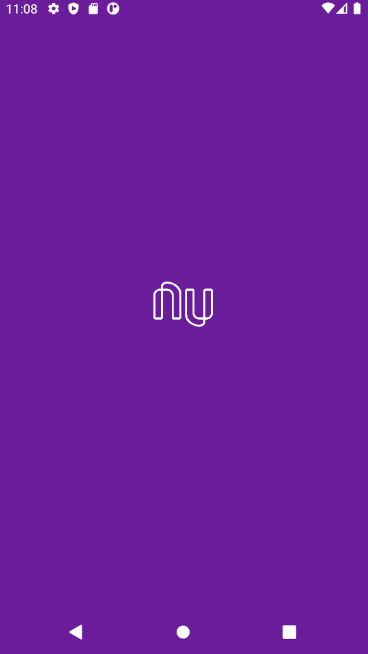
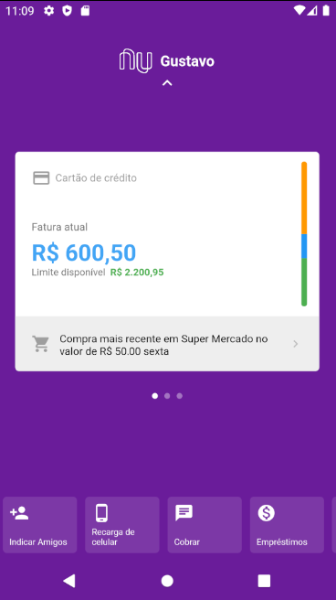
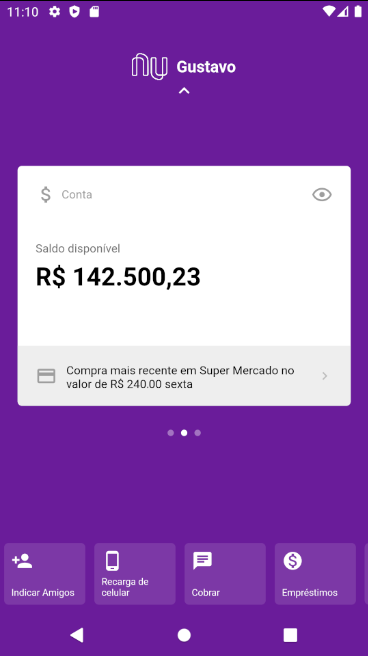
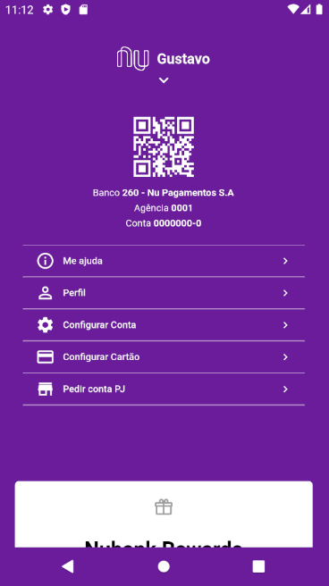

# Nubank Home

This project belongs to a my personal serie of "Recreating interfaces with flutter"

### Requirements

- Connected Device (simulator or physical device)
- Flutter stable version (preferable 1.24.0-2.0.pre.66)

### How to run

- Development
  - flutter run
- Production
  - flutter run --release

### Images

### References

- "Criando a Home do Nubank com Flutter - Por Renato Mota"
